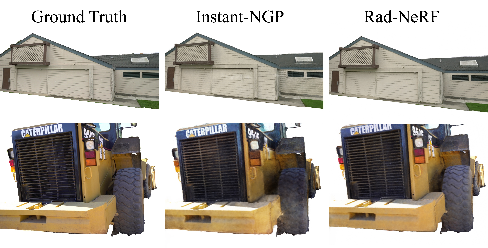
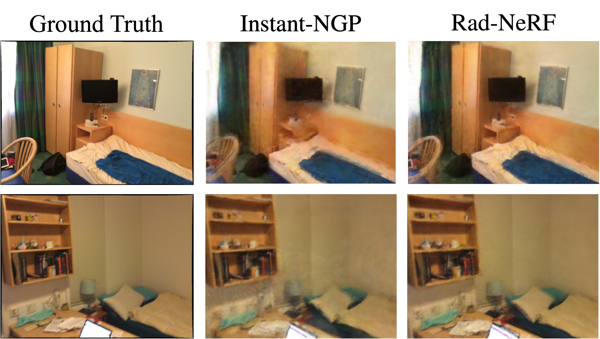
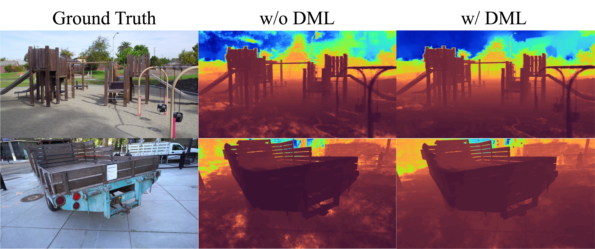
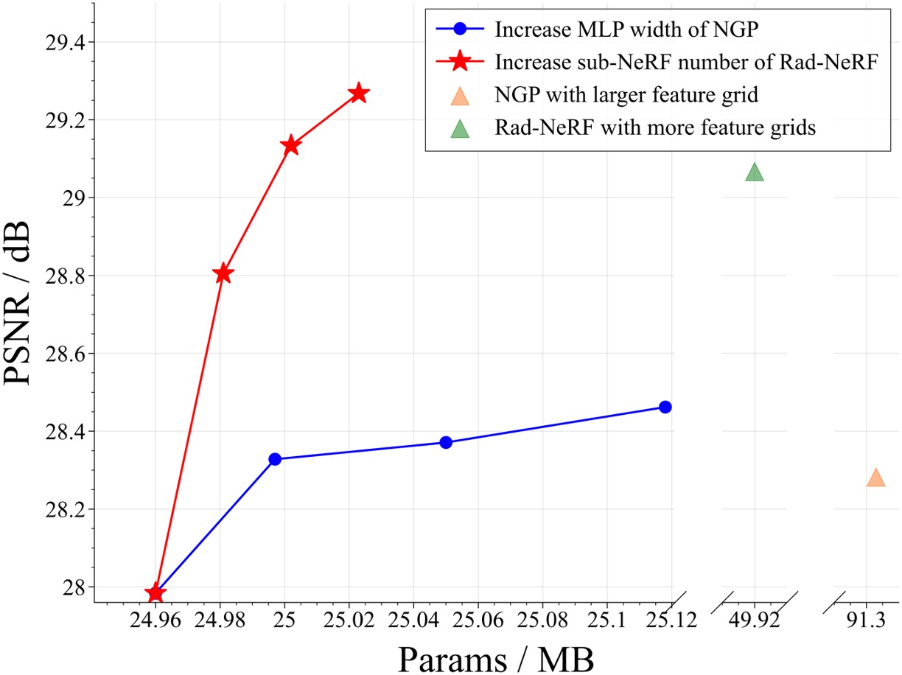
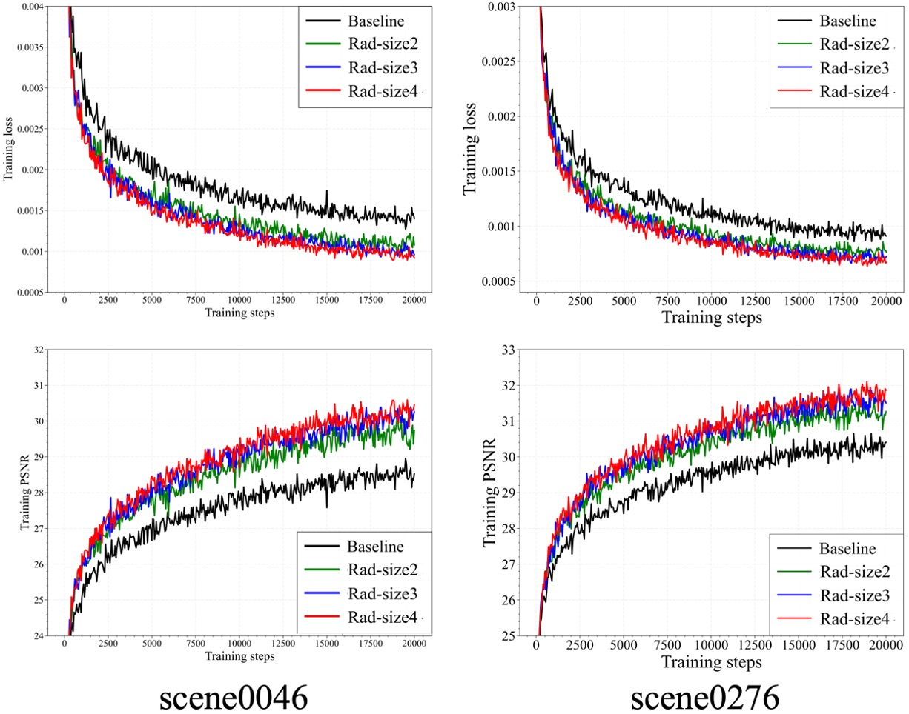

# Rad-NeRF: Ray-decoupled Training of Neural Radiance Field

**[[NeurIPS 2024]](https://openreview.net/forum?id=nBrnfYeKf9)** **[[Code]](https://github.com/thu-nics/Rad-NeRF)** **[[Video]]()**

In order to make NeRF better at rendering complex scenes, we delve into the reason for the unsatisfactory performance of NeRF in complex scenes and conjecture that it comes from interference in the training process. Due to occlusions in complex scenes, a 3D point may be invisible to some rays. On such a point, training with those rays that do not contain valid information about the point might interfere with the NeRF training. Based on the above intuition, we decouple the training process of NeRF in the ray dimension softly and propose a **Ra**y-**d**ecoupled Training Framework for neural rendering (**Rad-NeRF**). Specifically, we construct an ensemble of sub-NeRFs and train a soft gate module to assign the gating scores to these sub-NeRFs based on specific rays. The gate module is jointly optimized with the sub-NeRF ensemble to learn the preference of sub-NeRFs for different rays automatically. Furthermore, we introduce depth-based mutual learning to enhance the rendering consistency among multiple sub-NeRFs and mitigate the depth ambiguity. Experiments on five datasets demonstrate that Rad- NeRF can enhance the rendering performance across a wide range of scene types compared with existing single-NeRF and multi-NeRF methods. With only 0.2% extra parameters, Rad-NeRF improves rendering performance by up to 1.5dB.

If you find this repository or paper useful, you can cite

```
@inproceedings{
  guo2024radnerf,
  title={Rad-NeRF: Ray-decoupled Training of Neural Radiance Field},
  author={Lidong Guo and Xuefei Ning and Yonggan Fu and Tianchen Zhao and Zhuoliang Kang and Jincheng Yu and Yingyan Celine Lin and Yu Wang},
  booktitle={The Thirty-eighth Annual Conference on Neural Information Processing Systems},
  year={2024},
  url={https://openreview.net/forum?id=nBrnfYeKf9}
}
```

## Representative Results








|  |  |
| --------------------------- | --------------------------- |

## Installation

We run experiments on:

* OS: Ubuntu 20.04
* GPU and Library: NVIDIA GeForce RTX 3090, CUDA 11.8 (might also work with previous version)

Follow the following steps to setup the software environment:

* Create a new python environment

  ```
  conda create -n rad_nerf python=3.8
  conda activate rad_nerf
  ```
* Install pytorch and related libraries

  ```
  pip install torch==2.0.0 torchvision==0.15.1 torchaudio==2.0.1 --index-url https://download.pytorch.org/whl/cu118
  ```
* Install other necessary libiraries

  * Install `torch-scatter` following their [instruction](https://github.com/rusty1s/pytorch_scatter#installation)
  * Install `tinycudann` following their [instruction](https://github.com/NVlabs/tiny-cuda-nn#pytorch-extension) (pytorch extension)
  * Install `apex` following their [instruction](https://github.com/NVIDIA/apex#linux)
  * Install core requirements by `pip install -r requirements.txt`
* Cuda extension: Upgrade `pip` to >= 22.1 and run `pip install models/csrc/` (please run this each time you pull the code)

## Supported Datasets

1. [NSVF](https://github.com/facebookresearch/NSVF#dataset)
2. [NeRF++](https://github.com/Kai-46/nerfplusplus#data)
3. [MipNeRF360](http://storage.googleapis.com/gresearch/refraw360/360_v2.zip)
4. [Free](https://totoro97.github.io/projects/f2-nerf#data)
5. [TAT](https://www.tanksandtemples.org/download/)

## Training and evaluation

We provide example scripts for MaskTAT Dataset (Put the dataset under ./data/TanksAndTemple, including five scenes: Ignatius, Truck, Barn, Family, Caterpillar).

* Instant-NGP Baseline

  ```bash
  export SCENE_NAME=Ignatius/Truck/Barn/Family/Caterpillar

  CUDA_VISIBLE_DEVICES=0 python train.py \
  --root_dir ./data/TanksAndTemple/$SCENE_NAME --dataset_type nsvf --dataset_name TanksAndTemple --exp_name Instant-NGP \
  --scene_name $SCENE_NAME --downsample 1 \
  --num_epochs 20 --batch_size 8192 --lr 1e-2 --scale 0.5 --eval_lpips
  ```
* Rad-NeRF Experiment

  ```bash
  export SCENE_NAME=Ignatius/Truck/Barn/Family/Caterpillar

  CUDA_VISIBLE_DEVICES=0 python train_ml.py \
  --root_dir ./data/TanksAndTemple/$SCENE_NAME --dataset_type nsvf --dataset_name TanksAndTemple --exp_name Rad-NeRF \
  --scene_name $SCENE_NAME --downsample 1 \
  --num_epochs 20 --batch_size 8192 --lr 1e-2 --scale 0.5 --eval_lpips \
  --moe_training --model_zoo_size 2 --gate_type ray --depth_mutual_loss_w 5e-3 --cv_loss_w 1e-2
  ```

More options can be found in [opt.py](opt.py) and more example scripts are in ./scripts/.
